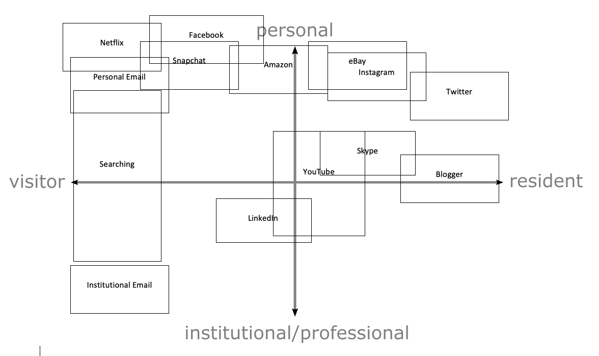

Quick notes:
- you can use the outline below as your template, amend it, or change it completely. Just make sure you use the [Chicago style referencing](https://www1.essex.ac.uk/students/study-resources/tdc/documents/referencing-chicago.pdf). 
- you should work on your drafts in your private repository. As discussed, you can add this written work to your public website as an additional page if you'd like, but makes sure you also submit a PDF version on FASER. 

## Reflection on digital identities

This writing briefly reflects on my understanding of

- digital identities in general
- my digital identities in the past/present
- my digital identities in the future

 

### Digital identities
To help identify and improve my digital identities, I explored [White et al.'s Visitor and Resident (V&R) concept](http://daveowhite.com/vandr/) which describes how the Visitors and Residents concept is a simple way of presenting the range of ways people can engage with the Web. It is a continuum of ‘modes of engagement’ rather than being two independent categories. Out of this, I found it interesting to evoke more thought in regards to the different ways in which myself and others use the internet and more about how the footprint we leave varies depending on which of these vistor or resident modes we occupy.

Note: The module outline has a page on [digital identities](https://github.com/krisztian-hofstadter-tedor/CS220-AU-navigating-the-digital-world/blob/main/digital-identities.md) - revise if needed. If you can, add more references i.e. not just the one to White et al. 

 

### My past/present digital identity/identities
Using the V&R map, I identified the following ways I engage with the Web in my visitor and resident modes (see photo/diagram below). 

   
 
  

To clarify:

- in my visiting mode, the primary activities are searching, email and Netflix.
- in my resident mode, the primary activities are Twitter and Blogger.
- the difference between my personal and institutional modes is that at this point in my career, my of my usage is in the personal sphere. This may change over time as I am currently a student and institutional usage may become more prevelant and I transition my focus more onto working and use the Web to aid my development in this.
 

 

### My future digital identity/identities
To help develop my digital identities I have:
- revised my current use of digital identities by giving it some critical thought.
- discussed the concept of digital identities and what makes for an improved version with my classmates.
- done online research for what makes a good professional online identity. I found that amongst other aspcets, in order to be visible, professional and take control of my digital identity I should have simple usernames such as @ConnorPeters, use a clear and professional profile picture of me, include a short and relevent bio, be active, create an 'About Me' page and delete or private any unwanted past posts that do not align with my desired professional digital identity. 
- used a [SWOT](https://duckduckgo.com/?q=swot&t=brave&ia=web) analysis (or another method that can help personal development) to understand my next steps
 
 
I beleive that some of the positive aspects of my digital identity thus far include that:
- - I have professional accounts such as LinkedIn which present my education and employment history and allow for possible connections to be made for future employment.
- I have been cautious with what I post on social media in the past and have recenlt deleted some content I now deem inappropriate.
- Some of my social media such as Instagram, Facebook and Snapchat are on private
- I have effectively used sites such as eBay to buy and sell products and have good reviews.
- Some of my Media Studies content from A-Levels can be accessed on a public Blogger account.
- I have used alias in the past for gaming accounts which separates them from my professional identity.
- I have posted YouTube videos displaying my academic work to an account in my name and recreational work has been posted to an account with an alias.
  
Note: Make sure you not only write about what you think needs improving, but also about what you think you are already doing well already regarding your digital identities. A good starting point is to talk about the good things you already do and then dive into what needs improving. In the next heading, you can list the aspects of your identities that need improving and then write about what ideas/methods you plan to use to improve them. 

After identifying and analysing my current use of digital identities on the Web, I set the goal to continue to keep my LinkedIn and bio up-to-date and accurate, continue to be wary of what I post to public accounts however to be more active for relevent and interesting content such as Blogger or Twitter. Additionally, I wish to follow more accounts on Twitter that align with my professional interests and to reply and interact with these posts more in the effort of making more connections and to be more engaged and integrated into the space. I aim to produce more intresting content in video format that can be uploaded to YouTube in an account in my name to reach a wider audience, generate a portfolio of my work and create more interest and connections. I should also use a new email address to seperate my personal and professional accounts. 

 

#### Objective 1 (example)
The above V&R map and its analysis highlighted ...

To address this (objective/weakness/threat, ...) I plan to 
- do this and that (read this and that, join a specific forum, amend/delete/add this or that, ...)
- by this deadline (perhaps you could write that you will set aside 1 hour every Monday to work on this objective)

 

#### Objective 2 (example)
...

By addressing these objectives my V&R map will look as follows: 

 

### Summery
This writing reflected (or in this writing I reflected) on my understanding of

1. digital identities in general and highlighted this and that
2. my digital identities in the past/present and highlighted this and that
3. my digital identities in the future and highlighted this and that

 

### Questions you should/could export 
- do I know people who are much older than me and can use technology efficiently e.g. the Web more efficiently?
- what does it actually mean "to use the Web more efficiently"?
- what's the difference between White et al.'s and Prensky's idea regarding people engaging with technology?
- on the V&R map, what's the fundamental difference between 'visitor' modes and 'resident' modes and what does the 'personal on institutional' dimension provide?
- how have I been using digital technology in different contexts i.e. how has my 'digital journey' changed since my first device e.g. the one given to me by parents?
- how can/should I (or shouldn't) link my personal identities to my professional identities?
- what implications do my visitor identities have on my personal life?
- what implications do my personal identities have on my professional/institutional life?
- what implications do my resident identities have on my personal life?
- what implications do my resident identities have on my professional/institutional life?
- how do I assess the credibility of information of other people (or institutions) e.g. does it matter how good their profile picture looks or how well their website is designed? 
- how much fact-checking could people do when visiting my resident identities e.g. my websites or social accounts and who much fact-checking do I need to do when referencing others' work?
- is a piece of information's creditably in line with how high the information ranks using a search engine?
- is a piece of information's creditably in line with the creditability (or the number of followers) of a mainstream or alternative broadcaster, its references and perhaps who it was reviewed by? Can this information be biased or could there be a conflict of interest? 
- what does it mean to critically evaluate information i.e. what is critical thinking?
- how do I develop my critical thinking regarding my engagement on the Web in my visitor and resident modes?
- what is my digital capability e.g. what aspect of technology am I comfortable/uncomfortable with?
- how can I improve my online presence e.g. by monitoring the time I spend on social media vs. work when using my computing device?
- how can I improve the way I interact with information online e.g. can I access a more mindful/objective instead of a more reactive/emotional/biased state of mind before sharing or commenting on something online?
- what information about my developing digital identities am I confident sharing publicly?

 

### Thoughts
- maybe also have the two maps next to each other for easy comparison
