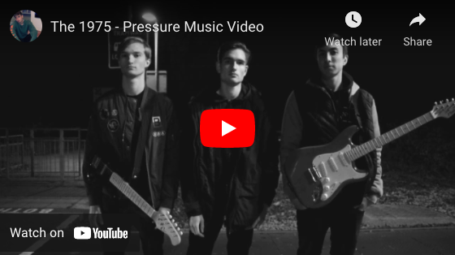
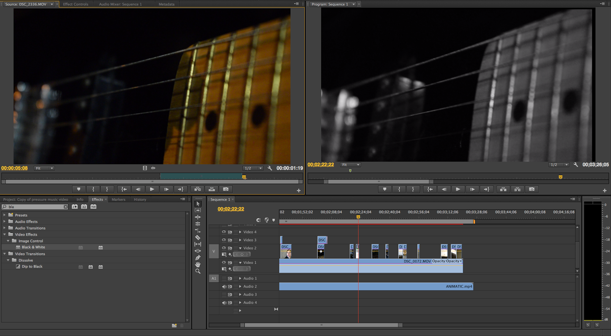

## Connor Peters
**Communications and Digital Culture student at the University of Essex**  

Hello! My name is Connor Peters. 

I am a student at the University of Essex studying Communications and Digital Culture. After studying Media Studies at A-Level, I worked for 2 years as a customer advisor at B&Q and as an administrative assisstant for HMCTS in South West London before deciding to enrol into a foundation year at university which lead me to study this degree. In the past I have been interested in editing videos and images and closely followed video game culture and esports. Now I am interested in media sociology and sociology in general, whilst also striving to maintain an apt knowledge of the lastest forms of technology and seeking to understand where technology may take us in the future.

 

## Social media links
- [LinkedIn](https://www.linkedin.com/in/connor-p-80676b121/)
- [YouTube]()

 

## Contact
- cp19834[at]essex[dot]co[dot]uk
- c[dot]peters068[at]gmail[dot]com

 

## Music Video Project
)](https://youtu.be/-_kmPpjo3DQ "The 1975 - Pressure Music Video") 

 

## Education

| Date | Qualification | Institute | Grade |
--- | --- | --- | ---
| ongoing | BA in Communications and Digital Culture | University of Essex | TBD |
| 2020 | BA in Communications and Digital Culture (Foundation Year) | University of Essex | First-Class Honours |
| 2017 | A-Level Media Studies | Glenthorne High School | B |
| 2016 | AS Film Studies | Glenthorne High School  | C |
| 2015 | GCSE Biology | Glenthorne High School  | A |
| 2015 | GCSE Chemistry | Glenthorne High School  | A |
| 2015 | GCSE English Language | Glenthorne High School  | A |
| 2015 | GCSE English Literature | Glenthorne High School  | B |
| 2015 | GCSE French | Glenthorne High School  | C |
| 2015 | GCSE Geography | Glenthorne High School  | A |
| 2015 | GCSE Maths | Glenthorne High School  | A |
| 2015 | GCSE Media Studies | Glenthorne High School  | A |
| 2015 | GCSE Physical Education | Glenthorne High School  | C |
| 2015 | GCSE Physics | Glenthorne High School  | B |
| 2015 | GCSE Religious Studies | Glenthorne High School  | B |
| 2013 | GCSE Science (Core) | Glenthorne High School  | A |

 

## Work experience
#### Customer Service Advisor, B&Q
#### Administrative Assisstant, HMCTS
#### Enrolment Officer, Merton College
#### COVID Tester, Carshalton Boys Sports College
 

 
 
  
 
 #### Test

 

**Editing - Production Log**

 
In this session we edited the recent footage gathered into our music video project on Premier Pro and also altered some of our older footage. We took time to consider the correct positions of these new shots, referring back to our animation and deciding what looks best. We also made some of these shots and previous shots black an white as we felt that this would fit the indie pop genre well as it is conventional of this genre and help create the atmosphere we wanted to fit with the song. 
 
  
 
In this editing session we made an effort to add any interesting effects that we thought fitted with our music video well in order to improve some particular shots such as the shot of all 3 of the band members walking across the train tracks. As layering with changing opacity levels was also a convention of the indie pop genre, we wanted to add this effect to this shot. We did this by copying the shot and putting one on the layer on top of another. We lowered the opacity of the top layer so that both could be seen at the same time and then changed the speed of the top layer so that it would give the effect of seeing two of all band members. 
 
  
 
In this editing session we also experimented with the 3 way colour effect, using it to bring out certain highlights of vivid colours and leaving the rest of the shot looking dull with low saturation. We used this on the shot shown below to exaggerate the red in the graffiti along with the shot of Chris walking through the tunnel. We animated this shot so that the colours would change as the shot progresses to add some dynamic editing to our music video and help create interest in the audience through attempting to make the video more visually interesting to watch.

  
 

 

 

## other relevant experience
### music technical officer at ARU
03/2015 – 04/2016 &nbsp; &nbsp; My key responsibilities were maintaining music, computer and audio resources, giving efficient and flexible technical support to students and staff as well as organising academic conferences and events.

### sole trader at Tedör Tea
2015 – ongoing &nbsp; &nbsp; I have been operating an independent tea company set up in Cambridge that imports health-giving Chinese teas and combines it with a variety of artworks produced by local artists. More info at [http://tedortea.com](http://tedortea.com).

 

Here is an example on how to embed an image from an external website:

 

And here is an example for embedding an audio player:
.
 

<iframe style="border: 0; width: 350px; height: 470px;" src="https://bandcamp.com/EmbeddedPlayer/album=3437348308/size=large/bgcol=ffffff/linkcol=0687f5/tracklist=false/transparent=true/" seamless><a href="https://tedor.bandcamp.com/album/secret-place-remixes">Secret Place + Remixes by Krisztián | tEdör | Hofstädter</a></iframe>

 

Here an example to embed a video:

<iframe width="560" height="315" src="https://www.youtube.com/embed/2nk_eLk1kGY" title="YouTube video player" frameborder="0" allow="accelerometer; autoplay; clipboard-write; encrypted-media; gyroscope; picture-in-picture" allowfullscreen></iframe>

   

My full CV can be found [here](https://khofstadter.com/assets/doc/KHofstader-CV.pdf).
