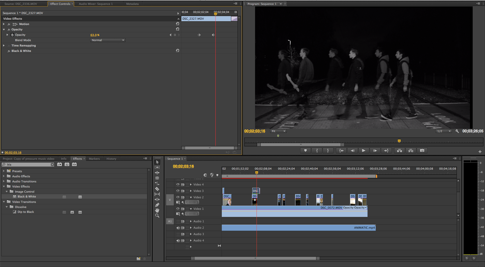

## Connor Peters
**Communications and Digital Culture student at the University of Essex**  

Hello! My name is Connor Peters. 

I am a student at the University of Essex studying Communications and Digital Culture. After studying Media Studies at A-Level, I worked for 2 years as a customer advisor at B&Q and as an administrative assisstant for HMCTS in South West London before deciding to enrol into a foundation year at university which lead me to study this degree. In the past I have been interested in editing videos and images and closely followed video game culture and esports. Now I am interested in media sociology and sociology in general, whilst also striving to maintain an apt knowledge of the lastest forms of technology and seeking to understand where technology may take us in the future.

## Social media links
- [LinkedIn](https://www.linkedin.com/in/connor-p-80676b121/)
- [YouTube](https://www.youtube.com/channel/UC09V1-uocMO4X11qk78KSJQ/featured)

## Contact
- cp19834[at]essex[dot]co[dot]uk
- c[dot]peters068[at]gmail[dot]com

 

## Education

| Date | Qualification | Institute | Grade |
--- | --- | --- | ---
| ongoing | BA in Communications and Digital Culture | University of Essex | TBD |
| 2020 | Communications and Digital Culture Foundation Year | University of Essex | First-Class Honours |
| 2017 | A-Level Media Studies | Glenthorne High School | B |
| 2016 | AS Media Studies | Glenthorne High School  | B |
| 2016 | AS Film Studies | Glenthorne High School  | C |

 

## Work experience
#### Administrative Assisstant, HMCTS (06/11/2017 - 22/06/2018)
My tasks included complex data entry, copying large volumes of Tribunal papers, and sending out session bundles to Tribunal panel members.  I worked in a part of a team that came into contact with the appeals, conversing with Tribunal panel members and venues over the phone, through email and in person. Throughout this process, I had very positive interactions with my various colleagues and managers I had over this period which enabled me to progress very quickly, given that that was my first job, and expand my skill set as I developed. This introduction into the workplace taught me a lot in terms of coping with working under pressure to meet figures and deadlines, as well as developing my ability to easily and efficiently communicate with others in a professional manner.
#### Stockroom Customer Advisor, B&Q (05/11/2018 - 21/06/2019)
#### Enrolment Officer, Merton College (09/2021)
#### COVID-19 Response, Carshalton Boys Sports College (01/2022)
 
  
 
## Relevant Projects

### Music Video Project 

[The 1975 - Pressure Music Video](https://youtu.be/-_kmPpjo3DQ)

 

*Image credit: Connor Peters*
 

*Image credit: Connor Peters, Michael Metz, Christopher Jupp*
 

I completed this project as a part of my A-Level Media Studies coursework in a group with two of my classmates. The end product included the music video, album cover and advertisement. The research, planning, production and evaluation of the project was all carefully discussed, analysed and documented on my [Blogger page](http://connorpeters2016.blogspot.com/) where you can use the labels at the top right corner of the webpage to navigate each procedure. An example of some of the editing production log from Adobe Premiere Pro is shown below.

 

**Editing - Production Log**

In this session we edited the recent footage gathered into our music video project on Premier Pro and also altered some of our older footage. We took time to consider the correct positions of these new shots, referring back to our animation and deciding what looks best. We also made some of these shots and previous shots black and white as we felt that this would fit the indie pop genre well as it is conventional of this genre and helps create the atmosphere we wanted to fit with the song. 
 

 
 
In this editing session we made an effort to add any interesting effects that we thought fitted with our music video well in order to improve some particular shots such as the shot of all 3 of the band members walking across the train tracks. As layering with changing opacity levels was also a convention of the indie pop genre, we wanted to add this effect to this shot. We did this by copying the shot and putting one on the layer on top of another. We lowered the opacity of the top layer so that both could be seen at the same time and then changed the speed of the top layer so that it would give the effect of seeing two of all band members. 
 

In this editing session we also experimented with the 3 way colour effect, using it to bring out certain highlights of vivid colours and leaving the rest of the shot looking dull with low saturation. We used this on the shot shown below to exaggerate the red in the graffiti along with the shot of Chris walking through the tunnel. We animated this shot so that the colours would change as the shot progresses to add some dynamic editing to our music video and help create interest in the audience through attempting to make the video more visually interesting to watch.

 

My full CV can be found [here](https://github.com/1901604/CS220-AU-portfolio/blob/main/assets/img/CV2021CONNORPETERS.pdf).

<iframe width="560" height="315" src="https://www.youtube.com/embed/-_kmPpjo3DQ" title="YouTube video player" frameborder="0" allow="accelerometer; autoplay; clipboard-write; encrypted-media; gyroscope; picture-in-picture" allowfullscreen></iframe>

